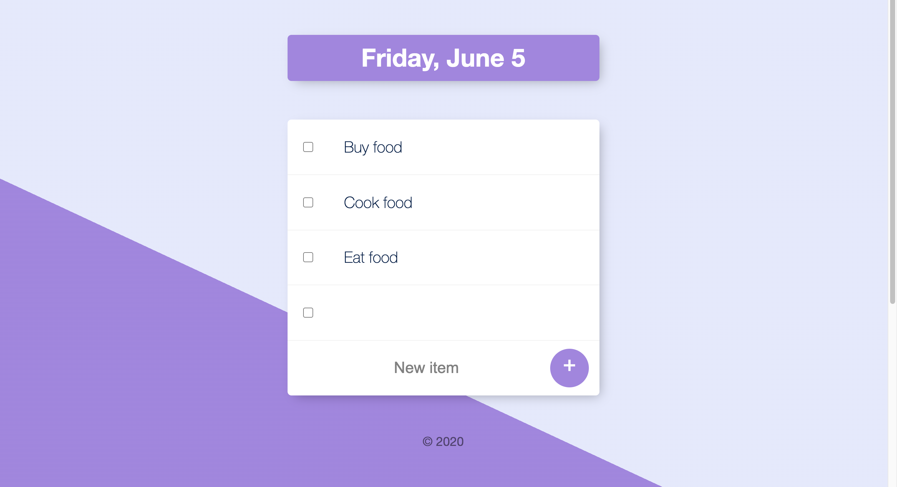

# Todo List Project with EJS templating

## Project installation 

App requires [Node.js](https://nodejs.org/en/download/) to run.

Install the dependencies and start the server with `nodemon`

```sh
$ cd todolist
$ npm install 
$ nodemon app.js
```

